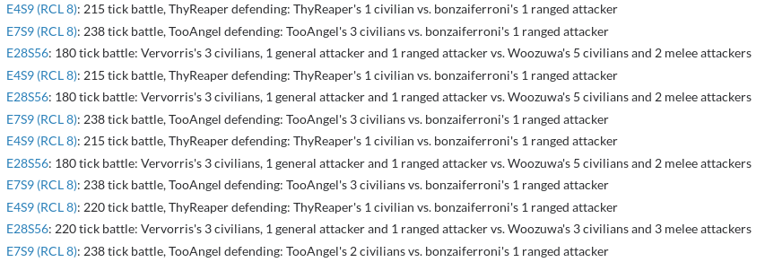
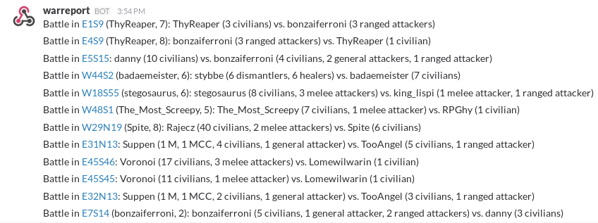

screeps-warreport
=================

DEPRECATED in favor of https://github.com/LeagueOfAutomatedNations/LeagueBot.

------

Screeps WarReport is a small standalone server application which tracks all recent battles in
[screeps.com](https://screeps.com), and includes various data from room history.

WarReport is built as an independent python 3.4 app, using asyncio for threading and redis as a backend database cache.
It's a design goal of WarReport to store all needed data in redis, so that if the application is shut down for any small
period of time, it will be able to immediately resume service and process any backlog which has accumulated when it's
put back online.

Any and all contributions welcome!

To run, simply install the required depeendencies with `pip install -r requirements.txt`, and then run 
`python -m warreport` in the project directory!

To stop, simply kill the process with Ctrl+C. This isn't too gracefully handled right now, but since no needed data is
stored in process memory and race conditions are avoided as much as possible, killing the application should have little
to no affect on the service.

To add custom configurations, copy `config.default.json` to `config.json` and edit.

Release logs, with pictures:

v0.0.2:

Version 0.0.2 fixes mostly all of the bugs of the previous release, but in itself adds its own. With actually correct gathering
of new battles after the first launch, it will report the same battle many, many times if it occurs over many ticks.

In this version, battles are reported if they involve creeps from at least two different players, and at least one military creep
from a player who doesn't own the room (doesn't report haulers wondering into owned rooms). This differentiation is useful, but
could also be detrimental if small (<9 WORK) dismantlers are at work, since it would be counted as a miner instead.

This version also gathers the battle length, and will report a length of 1 tick to 220 ticks (the maximum amount of history
searched over for battle info). While the battle-length reporting is technically correct, it counts dismantling as a 'hostile'
action, and thus this version will always report maximum battle length when there's a creep continuously dismantling an
already-destroyed owned room base.

v0.0.1:

Version 0.0.1 relatively works, although it only retrieves battles once (on startup) due to a bug, and it has large delays
in reporting rooms if there's a room for which a 20-tick period being looked for doesn't have history.

In this version, battles are reported if they involve creeps from at least two different players, and each reported battle message
contains the number of each type of creep each player had in the room at one point from 20-79 ticks before the battle to 161-220
ticks after.

